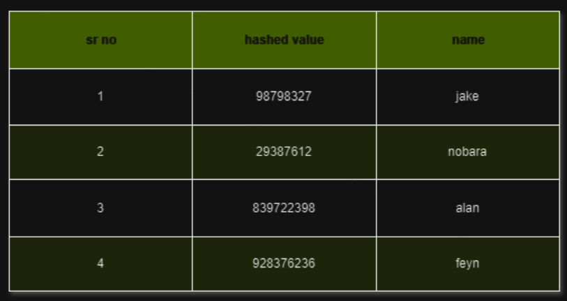

+++
title = 'Database Design Using Hash Indexes'
date = 2023-08-18T11:50:51+05:30
+++
Hi Guyz, This is alanturrr1703.

This is my first blog, and I really don't know what I am doing. But I will be writing these just for fun; some blogs might have some good points that might actually work for someone, but honestly, these blogs are my notes of the things that I am actually interested in.

## Why Do We Need Databases?

Starting with database design using Hash Indexes.

Now, what is really the need for databases? Why can't we use something like programs everywhere? When we are designing some software and say we want to output something that is, more often than not, static—say some data of a user of software. These kinds of problems, which are pretty general, lead to the need for a database. This data has to be some kind of permanent storage, so it can't be on RAM. It also should have features like there shouldn't be redundant compute, data recovery should be simple, and blah blah blah.

I feel like if you are reading my blog, you have already put in some kind of diligent work to know all these trivial things.

## What is Hashing and How Can It Be Used to Create Databases?

Now let's start addressing the elephant in the room.

What is hashing, and how can it be used to create databases? Well, let's get on with the real stuff—no, actually, for this blog, the real explanation is not required. Hashing is that secret formula that one applies to a number that gives data an ID, so it's a kind of encryption-decryption. If one knows the hashing formula or, for those who know mathematics, the hashing function, they can decrypt the data.

Now, we apply the hashing function not for the security of the data but actually for accessing the data as fast as possible.

Let's see this with an example:

Now here, fetching data is simple for many users.

For example, there is this `h(x)`, the hashing function. Whatever it may be, when one puts 1 into the function, it will always output `98798327`. And we know that at that place, particularly in the hard drive, the data is related to Jake. But this might not be the case when we use searching algorithms like binary search or linear search.

This may require `O(N)` space, but so does storing the data for searching. The fun part is that the time complexity of this algorithm is `O(1)`. While this can take a lot of time to write a large amount of data, which is `O(N)` with compute, the problem here is the collision of the data, like two hash functions giving the same output, say:

- `h(5) = 12345678`
- `h(10) = 12345678`

which is the same.

In this case, collision algorithms are used, which may increase the writing complexity to `O(N)`.

Using this hashing, we can design a database that works on hashing.

## Downsides of Hashing

Now let's understand the downsides of this.

1. Hashing happens in RAM; reading and writing happens via RAM.
2. RAMs are costly.
3. RAMs are not reliable for storing permanent data.
4. In case of any system failure, some of the data is erased due to this.
5. If you are not getting it from the above explanation, then read this explanation just for you—I will go in depth. 😘😘

You are thinking, why not store the hash function in hard disk memory itself? Well, you are not special; finding the data is tough.

Now you might be thinking that we can put it in such a way that it is very accessible. Alright, you are getting somewhere, but still, you are nothing special or a genius of some kind. This has also been done using Read-Ahead Log, which is like data you likely need next to read and preload into the system when restarting the system. But still, this can be made more efficient.

So yeah, this is a complete summary of how this works.

Enjoy! Do what you want with this information.

I will be back with two more ways to design a database.

HEHE. 😁😁😁😁
